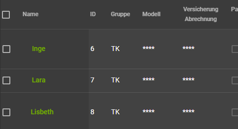

# FlotteFrontend


This project was generated with [Angular CLI](https://github.com/angular/angular-cli) version 10.0.8.

## HowTos

### Development server

Run `ng serve` for a dev server. Navigate to `http://localhost:4200/`. The app will automatically reload if you change any of the source files.

### Build

Run `ng build` to build the project. The build artifacts will be stored in the `dist/` directory. Use the `--prod` flag for a production build.

### Build Container

You can build a small container that runs a single executable that serves the front end. The web app is baked into the executable.
To build the container, run
```bash
docker build -t <tag> .
```
You can build the container for a different architecture. For example for arm64, run
```bash
docker build -t <tag:arm64> . --build-arg ARCH=arm64
```
See [here](https://golang.org/cmd/go/) for more info about how to build go binaries.

__Note:__ After [changing the urls](#Where-to-change-the-urls) for the back end you need to rebuild the container with the new urls.

### regenerate graphql schema, queries and mutations and more

Run `npm run generateGQL`
This project uses graphql codegen. /(https://graphql-code-generator.com/)
When running this command the graphql schema is fetched from the provided url in the codegen.yml file. This and the provided graphql queries and mutations you can find in src/app/graphqlOperations/ are used to automatically generate corresponding apollo services. (https://graphql-code-generator.com/docs/plugins/typescript-apollo-angular)

The services of the frontend are using theese apollo services to communicate with the backend. If a query changes it only has to be changed in the query or fragment in src/app/graphqlOperations/.
If the right url is provided in the apollo.config.js (to the graphql schema) and the apollo graphQL VS Code Extension installed, you will have autocompletion when writing thoose queries/mutations/fragments.

The generated src/generated/graphql.schema.json is used by the schema.service.ts. This service has functions to get type information for given type names and properties or to filter objects so that only properties from the given graphql type (name) are left over.

## good-to-knows :D

We often use flatten() and deepen() in the table and data-page components. Theese functions can be found in src/app/helperfunctions/.
The flatten function e.g. gets an object: {id: "7", dimensionsAndLoad: {length: 4, height: 12}} and returns it as flattened object: {id: "7", dimensionsAndLoad.length: 4, dimensionsAndLoad.height: 12}. flatten() does the opposite.
Theese steps are necessary - the reason for that will now be shown:

The table component takes a columnInfo array as a property input and shows the coulumns with the specified headers and data accordingly.
The columnInfo could look like this:
```
[
    { dataPath: 'name', translation: 'Name', sticky: true },
    { dataPath: 'id', translation: 'ID', readonly: true },
    { dataPath: 'modelName', translation: 'Modell' },
    { dataPath: 'insuranceData.billing', translation: 'Versicherung Abrechnung' },
    ...
]
```
--> 

The dataPath specifies what data is shown in each column. In the fourth column the data of bike.insuranceData.billing is shown e.g..
This Information has to be passed to the cell components dynamically which is only possible in this form: data[columnInfoElement.dataPath].
```
<app-cell
    ...
    [(value)]="element[column.dataPath]"
    ...>
</app-cell>
```
We can't pass it in an other form, else it would not be possible to pass a value, that is deeper in the data object than the first level (like insuranceData.billing), which is why the data has to be flattened to add it dynamically to a table or data-page.

### Where to change the urls
If the backend url changes, it has to be changed in the following files:
- ./src/environments/
- ./apollo.config.js for autocompletion when writing queries etc.
- ./codegen.yml for graphQL codegen (to generate schema, types etc.)
